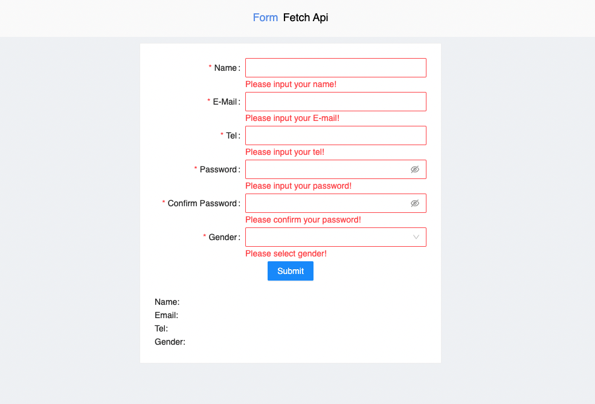
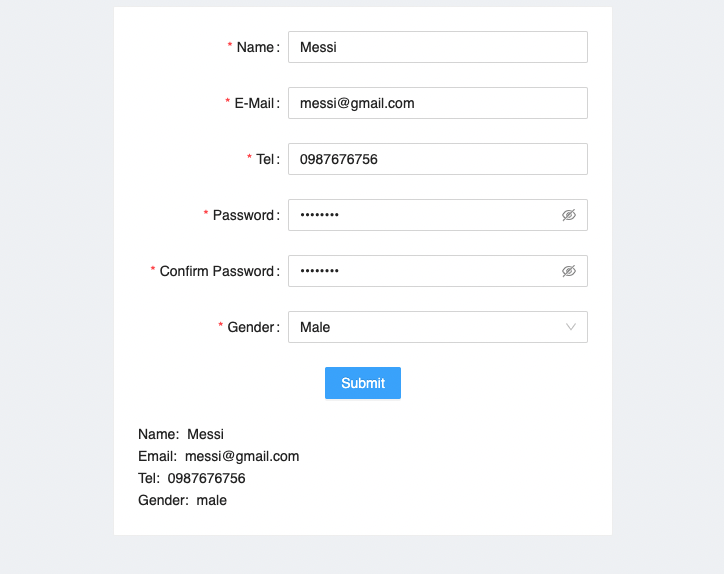
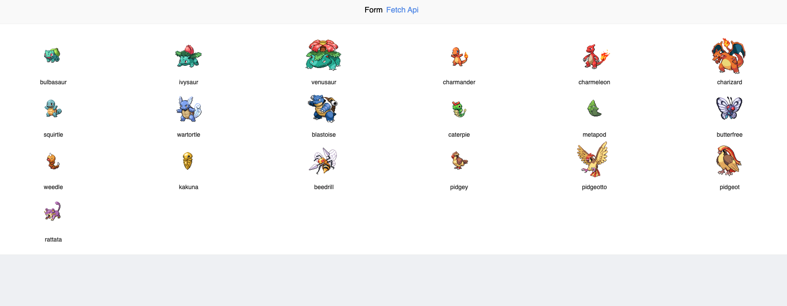

Frontend Developer Test
- ใช้ React ในการทำตาม Requirement

Requirement

    1.สร้าง form และ validate ข้อมูล
    2.ดึงข้อมูลจาก pokemon's api และแสดงผล 

- ### สร้าง form สำหรับกรอกข้อมูล ดังตัวอย่าง
  
- ### เมื่อ validate form ผ่านให้แสดงผลลัพท์ดังตัวอย่างด้านล่าง
  

## 2. Test fetch Pokemon's api

- ### fetch pokemon's data จาก `https://pokeapi.co/api/v2`
- #### ดึงข้อมูลของ pokemon แต่ละตัวผ่าน api ex. GET-> https://pokeapi.co/api/v2/pokemon/1
- #### ดึงข้อมูลของ pokemon id ที่ 1-104 แล้วนำมาแสดงในหน้ารวม
- #### ให้แสดง ชื่อ,รูป ของ pokemon เท่านั้น และแสดง แถวละ 6 ตัว ดังตัวอย่าง
  
- #### สามารถแสดงแบบ Responsive ได้ด้วย
** หมายเหตุ ข้อนี้เป็นเพียงข้อคะแนนพิเศษ สามารถข้ามข้อนี้ได้
- ใช้ Docker หรือ Docker Compose ในการสร้าง Service Frontend

***
- เมื่อทำเสร็จแล้วให้ push code ที่ได้เสร็จเรียบร้อย ไปยัง Repository ของตนเอง และแนบลิ้งค์ตอบกลับอีเมล์มายังบริษัท
- เมื่อบริษัทได้ทำการตรวจสอบเรียบร้อยแล้ว บริษัทจะนัดหมายผู้ทดสอบในการสัมภาษณ์และ Remote เพื่อดูผลลัพท์ web application (ไม่จำเป็นต้อง deploy application)

** หากมีปัญหาหรือข้อสงสงสัยให้ติดต่อกลับโดยด่วน ผ่านช่องทางดังต่อไปนี้
- sc.sivakorn@gmail.com (จัมโบ้)
- anchalee.tav@gmail.com (ตวง)
